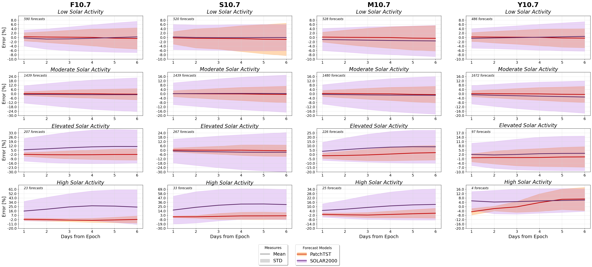

<h1 align="center">Solar and Geomagnetic Indices Forecasting Framework Using Transformers</h1>

<p align="center">
    <a href="https://arxiv.org/abs/2406.15847">
        
    </a>
</p>


This repository compiles the framework implementations developed so far, aiming to achieve **efficient and highly accurate** measurements of geomagnetic and solar indices. To meet these objectives, we propose a **transformer-based framework**.

Our primary focus is on **PatchTST** (Patch Time-Series Transformer), as proposed by [(Nie et al., 2022)](https://arxiv.org/pdf/2211.14730). PatchTST enhances time-series forecasting by dividing data into patches, effectively capturing local patterns. Its **channel-independent encoding** processes each variable separately, reducing interference between variables, while **transformer encoder layers** capture long-term dependencies. This architecture efficiently models both short- and long-term patterns while maintaining **computational efficiency**.



The framework also includes a **custom loss function** that adjusts for imbalances in solar activity levels, improving accuracy during volatile periods. With an optimized **validation strategy**, it ensures strong generalization across various solar activity levels. Additionally, we have explored **Dst** and **Ap indices** predictions, using different approaches, such as combining them after preprocessing or decomposing them into trend, seasonal, and residual components.


## Key takeaways💡
* **Improved Accuracy**: The model achieves a 77% better MPE and 60% better SMPE than the SET benchmark, especially during high solar activity 🌞.

* **Custom Loss Function**: A tailored loss function balances solar activity levels, improving forecast accuracy for volatile periods 📊.

* **Efficient and Fast**: Patching and channel independence reduce memory usage, cut computational complexity, and enable training in under two minutes using dual GPUs ⚡💻.

* **Robust Validation**: A carefully crafted validation split ensures the model performs well across various solar activity levels, enhancing prediction reliability and the model ability of generalization🔍.

* **High Activity Forecasting**: The model excels during high solar activity, showing an 83% improvement in MPE 🚀.

## Setup ⚙️

To make sharing the code implementation easier and avoid dependency issues, we've used [DevContainers Tool](https://marketplace.visualstudio.com/items?itemName=ms-vscode-remote.remote-containers) in Visual Studio Code. This tool deploys a Docker container with all the necessary dependencies, so you will need to install this code editor to run our code. If you're new to this environment, please follow [this tutorial](https://code.visualstudio.com/docs/devcontainers/tutorial) to set up your environment.

Additionally, we use [Weights and Biases (W&B)](https://wandb.ai/site) to manage different trainings and experiments. Much of the code depends on W&B functions, so we recommend using it for seamless code execution. You can follow their [tutorials](https://docs.wandb.ai/tutorials) to get started. If you prefer not to use W&B, make sure to **comment out** all lines where the W&B API is called.

Make sure the `.devcontainer/devcontainer.env` file exists because the build process will attempt to access it and throw an error if it can't be found. The file should be included in the repository you've downloaded but with a `.txt` extension. If you're using W&B, fill in the `devcontainer.env` file with the required information.

> [!IMPORTANT]  
> Before building the container, make sure you've **added the `.env` file** and that **Docker is running**.

Once everything is configured, you can build your project by pressing <kbd>Ctrl</kbd>+<kbd>⬆️</kbd>+<kbd>P</kbd> to open the command palette and selecting `Dev Containers: Build Project and Re-open inside a container`.

At this point, your environment should be set up and running.

> [!NOTE]  
> If you encounter issues during the container build, try removing the following arguments from the `devcontainers.json` file:
> ```json
> "${localEnv:EXISTS_GPU:--gpus}", "${localEnv:EXISTS_GPU:all}"
> ```
> This error may occur due to GPU detection issues. If you have a dedicated GPU, add these arguments instead:
> ```json
> "--gpus", "all"
> ```
> Otherwise, remove the mentioned arguments entirely.


## Contents 📚

Here we made a short description of the repository folder structure. Inside each of the main foilders you can also find some README.md files explaining its contents. 

- [`/dev_nbs`](/dev_nbs/): In this folder you can find all the code implementation refering to the data preparation, model training process, evaluation and hyperparameter tunning. Please for further information about this folder check its `README.md` file.

- [`/data`](/data/): This folder recopilates all the data that is being used inside the repository. In general, the files are automatically generated inside the code if they do not exist, however not all the data can be generated so please avoid deleting files without being sure they can be deleted. In case you want to update the data, you can change the `force_download` flag you can found in some of the configuration files, inside `dev_nbs`.

- [`/nbs`](/nbs/): This folder contains the implementation and explanation of all the functions needed for the code implementation, that will be reused in different parts of the code implementation. Please for further information about this folder check its `README.md` file.

> [!NOTE]
> We also use in our implementation [`nbdev`](https://github.com/fastai/nbdev) tool for development inside jupyter notebooks. For this reason inside the `nbs` folder we have the notebooks with explanations and test of different functions that then will be used in the code. However the final functions are exported using this tool into the `swdf` folder. To do so we make use of #|export tag, so please do not delete those tags if you improve the code.

- [`requirements.txt`](/requirements.txt): If you want to globally install dependencies inside the container, you must add them and rebuild the container using the command palette.


The other folders are not relevant for the code use.

## Acknowledgments 🗣️

Along all the repository we have used [`tsai`](https://github.com/timeseriesAI/tsai) library implemented by Iganacio Oguiza, so we want to give him special thanks for its work and some of the ideas here implemented. Furthermore, we specially acknoledge [Space Enviroment Technologies (SET)](https://spacewx.com/) for providing with a great portion of their data.


## Affiliation ✒️

This work has been implemented as a collaboration between members of the [Applied Intelligence and Data Analysis research group (AI+DA)](https://aida.etsisi.upm.es/) from Universidad Politécnica de Madrid (UPM) and researchers from [Astrodynamics, Space Robotics, and Controls Lab (ARCLab)](https://aeroastro.mit.edu/arclab/) from the Massachussets Institute of Technology (MIT).

<div align="center">
  <table style="border-collapse: collapse; border: none;">
    <tr style="border: none;">
      <td align="center" style="padding-right: 50px; border: none;">
        <br/>
        
      </td>
      <td align="center" style="padding-left: 50px; border: none;">
        <br/>
        
      </td>
    </tr>
  </table>
</div>

